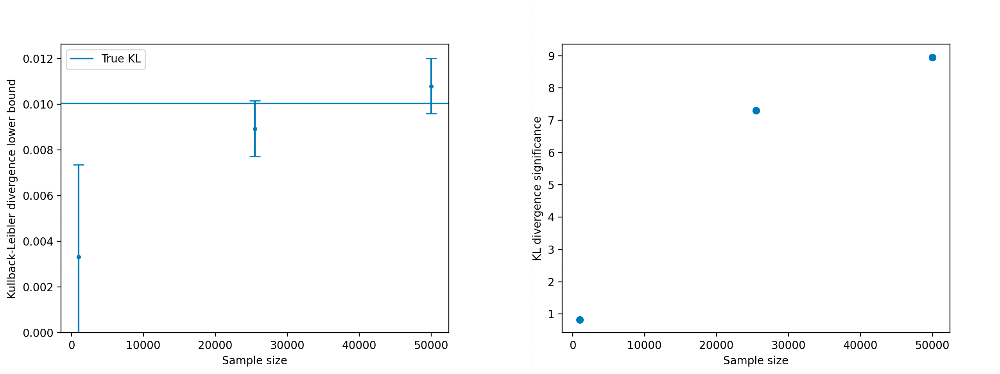

# IWPC

`iwpc` implements the methods of [arXiv:2405.06397](https://arxiv.org/abs/2405.06397) for estimating a lower bound on the f-divergence (Kullback–Leibler, Jensen–Shannon, ...) between two distributions p and q from samples drawn from each. The same machinery is reused for **dataset reweighting** and **distribution learning** (density estimation and conditional kernels).

Install with `pip install iwpc`. The package is organised around [PyTorch Lightning](https://lightning.ai/docs/pytorch/stable/) — some familiarity with `LightningModule` / `LightningDataModule` / `Trainer` is recommended.

The plots in the [original paper](https://arxiv.org/abs/2405.06397) are reproduced by [`examples/parity_example.py`](examples/parity_example.py).

---

## What's in the package

`iwpc` is split into focused sub-packages. Each has its own `README.md` (human-oriented) and `AGENTS.md` (terse notes for coding agents).

| Sub-package | What it does |
|---|---|
| [`divergences/`](src/iwpc/divergences/README.md) | Abstract `DifferentiableFDivergence` interface + `KLDivergence`, `JensenShannonDivergence`. Pure math, with both numpy and torch backends auto-dispatched on input type. |
| [`modules/`](src/iwpc/modules/README.md) | The `FDivergenceEstimator` `LightningModule` hierarchy that learns the variational lower bound. Includes `NaiveVariationalFDivergenceEstimator`, `GenericNaiveVariationalFDivergenceEstimator`, and the symmetry-aware `AsymmetryEstimator`. |
| [`data_modules/`](src/iwpc/data_modules/README.md) | `LightningDataModule` adapters: `BinaryPandasDataModule` (in-memory DataFrames), `BinaryNumpyDataModule` (ndarrays), and `PandasDirDataModule` (sharded pickle directory, required for the reweight loop). |
| [`datasets/`](src/iwpc/datasets/README.md) | `torch.utils.data.Dataset` implementations backing the data modules. |
| [`encodings/`](src/iwpc/encodings/README.md) | Composable `nn.Module` feature rewrites (periodic, even/odd, log/exp, matrix-shape, ...). Used as the first/last layer of a network to bake in priors like periodicity or evenness. |
| [`models/`](src/iwpc/models/README.md) | `basic_model_factory` — the canonical builder that wires an input `Encoding`, a normalised MLP body, an output `Encoding`, and optional symmetry wrappers into a single `nn.Sequential`. |
| [`symmetries/`](src/iwpc/symmetries/README.md) | Haar-averaging wrappers (`SymmetrizedModel`, `ComplementModel`) that make a network invariant under (or orthogonal to) a user-declared `GroupAction`. |
| [`metrics/`](src/iwpc/metrics/README.md) | Lightweight `torchmetrics.Metric` accumulators (`WeightedMeanMetric`, `StatMetric`) used to produce `val_Df` and `val_Df_err`. |
| [`accumulators/`](src/iwpc/accumulators/README.md) | Post-hoc divergence estimation from precomputed log-ratios with proper standard errors. `BinnedDfAccumulator` produces the 1D / 2D diagnostic plots shown below. |
| [`visualise/`](src/iwpc/visualise/README.md) | Interactive 1D / 2D sweep plotters (matplotlib + Bokeh backends) for sanity-checking a trained estimator's learned function. |
| [`scalars/`](src/iwpc/scalars/README.md) | Tiny value-objects bundling a label, LaTeX label, and bin array — used as plotting / binning metadata by the visualisers and the binned accumulator. |
| [`learn_dist/`](src/iwpc/learn_dist/README.md) | The distribution-learning side of `iwpc`: trainable conditional kernels `k(y\|x)`, sampleable base distributions, and an f-divergence-minimising training loop. Independent of `calculate_divergence` but reuses the divergence machinery. |
| [`learn_dist/kernels/`](src/iwpc/learn_dist/kernels/README.md) | ~25 trainable kernels (Gaussian, mixture, finite-support, branching, ...) + adversarial trainers. |
| [`learn_dist/base_distributions/`](src/iwpc/learn_dist/base_distributions/README.md) | Fixed sampleable distributions (uniform, Cauchy, exponential, multivariate normal, histogram) used as latent noise sources for kernels. |
| [`learn_dist/fdivergence_minimization/`](src/iwpc/learn_dist/fdivergence_minimization/README.md) | Adversarial trainer that fits a kernel to minimise a chosen `DifferentiableFDivergence` against a target. |

Top-level files: [`calculate_divergence.py`](src/iwpc/calculate_divergence.py) (main entry point), [`reweight_loop.py`](src/iwpc/reweight_loop.py) (iterative reweighting driver), [`utils.py`](src/iwpc/utils.py).

---

## Conventions

A handful of conventions are assumed everywhere in the divergence-estimation flow. Worth memorising before reading any sub-package docs:

- **Batch contract:** `(features, labels, weights)`. **`labels == 0` marks samples from `p`, `labels == 1` marks samples from `q`.** The reweight loop, accumulators, and `split_by_mask` all assume this layout.
- **Validation metric:** `val_Df` (the divergence lower bound — higher is better) and `val_Df_err` (its standard error). Early stopping, `ModelCheckpoint`, and the LR scheduler all monitor `val_Df` with `mode="max"`.
- **Numerical stability:** `log(p/q)` is clipped to `[-14, 14]` before exponentiation in the naive estimator and in accumulators. Stay consistent with this in any new estimator or accumulator.
- **Banner suppression:** set `DISABLE_IWPC_WELCOME=1` to silence the ASCII banner printed from `iwpc/__init__.py`.

The `learn_dist/` sub-package uses different per-trainer batch contracts and logs `val_loss` / `val_divergence` instead of `val_Df` — see its README.

---

## Quick start: estimating a divergence

The simplest workflow uses [`calculate_divergence`](src/iwpc/calculate_divergence.py). The example [`examples/continuous_example_2D.py`](examples/continuous_example_2D.py) runs it on 2D vectors drawn from `N(r | 1.0, 0.1) * (1 + eps * cos(theta)) / (2π)` for two values of `eps` and compares the estimated KL and Jensen–Shannon lower bounds to numerically integrated values.

At minimum `calculate_divergence` needs a `LightningDataModule` and an `FDivergenceEstimator`:

```python
from iwpc.calculate_divergence import calculate_divergence
from iwpc.data_modules.pandas_data_module import BinaryPandasDataModule
from iwpc.modules.naive import GenericNaiveVariationalFDivergenceEstimator
from iwpc.divergences.kl_divergence import KLDivergence

dm = BinaryPandasDataModule(
    p_df=p_df, q_df=q_df,
    feature_cols=["x", "y"],
    weight_col="weight",      # optional
)
estimator = GenericNaiveVariationalFDivergenceEstimator(
    input=2, divergence=KLDivergence(),
)
result = calculate_divergence(estimator, dm, trainer_kwargs={"max_epochs": 200})
print(result.divergence, "±", result.divergence_stderr)
```

`calculate_divergence` wires up a Lightning `Trainer` with `ModelCheckpoint(monitor="val_Df", mode="max")`, `EarlyStopping`, and `LearningRateMonitor`, runs `trainer.fit`, reloads the best checkpoint, validates, and returns a `DivergenceResult` containing the divergence estimate, its standard error, the best module, the trainer, and the checkpoint path.

Logs and checkpoints land under `<log_dir>/lightning_logs/<run>/` (default `log_dir=cwd`). Monitor in your browser with `tensorboard --logdir lightning_logs`.



For input data with known structure — angles, even / odd dependences, matrix-shaped features — wrap or replace the integer `input=` with an [`Encoding`](src/iwpc/encodings/README.md), e.g. `input=TrivialEncoding(1) & ContinuousPeriodicEncoding()` for an `(r, θ)` input. The factory automatically inserts the encoding as the first layer and sizes the network from `encoding.output_shape`.

To bake in a symmetry of `p` and `q` (e.g. invariance under reflection), pass `symmetries=[my_action]` through `basic_model_factory` — see [`symmetries/`](src/iwpc/symmetries/README.md).

---

## Reweighting large or hard datasets

For datasets that don't fit in memory, or networks that get stuck in local minima, use [`run_reweight_loop`](src/iwpc/reweight_loop.py) together with [`PandasDirDataModule`](src/iwpc/data_modules/README.md). [`examples/example_reweight_loop.py`](examples/example_reweight_loop.py) demonstrates the workflow.

`PandasDirDataModule` reads a directory of `file_0.pkl ... file_{N-1}.pkl` shards plus a `ds_info.yml` index, lazily loading shards into memory. Train / validation split is **by file** (first `ceil(N * split)` files for training), so the on-disk ordering must already be unbiased — use the builder's `shuffle=True`.

`run_reweight_loop` repeatedly calls `calculate_divergence`. Whenever the resulting significance exceeds `min_sig`, it adds a new `p_over_q_{i}` column to the dataset, multiplies the weight column by `min(p/q, q/p)` (clipped at 1) to wipe out the learnt feature, and re-runs with a decayed learning rate. The final dataset carries a chain of reweight columns; `calculate_total_divergence` reconstructs the cumulative divergence by taking their product.

Only `PandasDirDataModule` supports `run_reweight_loop` (the in-memory modules lack the `.transform` / `.reweight` / `.copy` / `tags` machinery).

### Diagnostic plots

Once trained, `BinnedDfAccumulator` answers the natural follow-up question: **how exactly is the network telling p and q apart?** It partitions samples by user-chosen variables and attributes the global divergence to each bin.

See [`examples/example_reweight_loop.py`](examples/example_reweight_loop.py) for the full setup; the accumulator is constructed with a list of [`ScalarFunction`s](src/iwpc/scalars/README.md) (one per axis to bin) and a `DifferentiableFDivergence`, then `.evaluate(datamodule, p_over_q_cols)` walks the validation shards before `.plot()` renders the panels below.

The first plot below shows the divergence as a function of radius `r`. The top-left panel is the validation histogram of `r` under p and q; since both were drawn from the same Gaussian, they agree. The top-right panel is the divergence within each `r` bin — flat in `r`, as expected.


The source of the divergence becomes obvious in the `θ` plots: the marginalised divergence matches the global value, confirming that all of the divergence comes from `θ`. The bottom panels show the network's learnt distributions in `θ` (with reconstruction error bars — these say how well we can read out what the network believes, **not** how close that belief is to the truth).


The 2D plot in `(θ, r)` is mostly redundant for this dataset, but confirms the same features. Top-left: ratio of the two distributions in validation. Top-right: divergence within each bin. Bottom-left: the network's learnt ratio. Bottom-right: a histogram of p.


`BinnedDfAccumulator`'s plotting currently supports 1D and 2D only.

---

## Distribution learning: `iwpc.learn_dist`

The [`learn_dist/`](src/iwpc/learn_dist/README.md) sub-package uses the same divergence machinery for the **inverse** problem: fitting a parametric distribution to a set of target samples. Two workflows:

- **`DistributionApproximator`** ([`learn_dist/classifier_reweighting.py`](src/iwpc/learn_dist/classifier_reweighting.py)) — learns an unconditional density by training a classifier that reweights a tractable proposal (a [`SamplableBaseModel`](src/iwpc/learn_dist/base_distributions/README.md)) to match the target samples.
- **`FDivergenceMinimizingKernelTrainer`** ([`learn_dist/fdivergence_minimization/`](src/iwpc/learn_dist/fdivergence_minimization/README.md)) — trains a [trainable kernel](src/iwpc/learn_dist/kernels/README.md) `k(y|x)` (Gaussian, mixture, finite-support, branching, ...) by minimising a chosen `DifferentiableFDivergence` against samples from a target, using a learned `log(p/q)` discriminator and a score-function surrogate.

The kernel library composes flexibly: `GaussianKernel & GaussianKernel` builds an independent product, `MixtureKernel([k1, k2], weights)` builds a mixture, `ConditionedKernel` makes any kernel conditional on additional inputs, and the parallel `FiniteKernelInterface` family supports discrete sample spaces with exact `log_prob` evaluation.

`learn_dist/` reuses `DifferentiableFDivergence`, `basic_model_factory`, and `Encoding` from the main flow, but **does not** use `calculate_divergence` or `run_reweight_loop`, and its trainers define their own per-batch contracts and metrics (typically `val_loss` rather than `val_Df`).

---

## Encodings

[`iwpc.encodings`](src/iwpc/encodings/README.md) provides composable `nn.Module` feature rewrites that bake in structural priors. Examples:

- `TrivialEncoding(d)` — identity passthrough of `d` features.
- `ContinuousPeriodicEncoding()` — maps `θ → (cos θ, sin θ)`, enforcing strict periodicity.
- `AbsEncoding()`, `SignEncoding()` — enforce even / odd dependence in the learnt function.
- `LogEncoding`, `ExponentialEncoding`, `ReciprocalEncoding` — `x → log x` etc., for distributions spanning many orders of magnitude.
- `MatrixEncoding`, `AntiSymmetricMatrixEncoding` — reshape flat feature vectors into matrices to feed structured downstream models.
- `LogSoftmaxEncoding`, `SphericalUnitVectorEncoding` — outputs constrained to a simplex / sphere.

Encodings compose with `&` (concatenation onto adjacent slices), e.g. `TrivialEncoding(1) & ContinuousPeriodicEncoding()` for `(r, θ)`. `basic_model_factory` accepts an `Encoding` (or an int) as its `input=` and as its `output=`.

---

## Symmetries

[`iwpc.symmetries`](src/iwpc/symmetries/README.md) makes a network invariant under (or orthogonal to) a user-declared `GroupAction`, by Haar-averaging the model over a batch of group elements per forward pass. `GroupAction.symmetrize(model)` produces an invariant wrapper; `.complement(model)` produces the orthogonal-complement wrapper. Group actions compose with `&` (disjoint product on different feature slices) and `*` (joint composition on the same space).

`basic_model_factory` accepts `symmetries=[...]` and `complement_symmetries=[...]` and applies the wrappers after MLP construction. `AsymmetryEstimator` ([`modules/`](src/iwpc/modules/README.md)) uses the same machinery to symmetrise the log-ratio summands rather than the network itself.

---

## Visualising learnt functions

[`iwpc.visualise`](src/iwpc/visualise/README.md) provides 1D and 2D function sweepers in two backends:

- **matplotlib** (`MultidimensionalFunctionVisualiser1D` / `2D`) — local scripts, static plots. Bind the visualiser to a variable to keep its GUI sliders alive.
- **Bokeh** (`BokehFunctionVisualiser1D` / `2D`) — interactive HTML; the 2D heatmap auto-spawns a 1D tab when you click an axis label.

Useful for sanity-checking what the divergence estimator (or a trained kernel) has actually learnt. See [`examples/multidimensional_function_visualiser_example.py`](examples/multidimensional_function_visualiser_example.py).

---

## Help and citation

For questions or suggestions please reach out to [Jeremy J. H. Wilkinson](mailto:jero.wilkinson@gmail.com).

If `iwpc` has been helpful in your research, please cite [arXiv:2405.06397](https://arxiv.org/abs/2405.06397).
