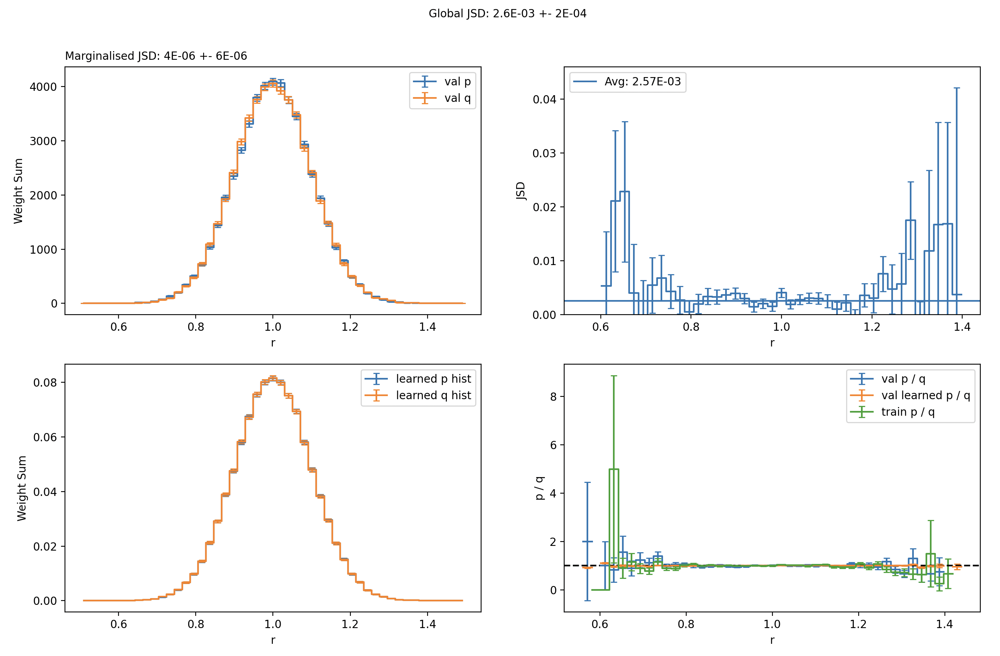
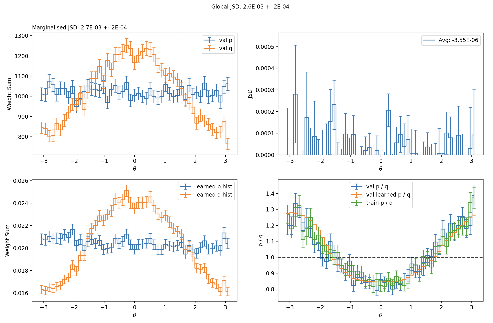
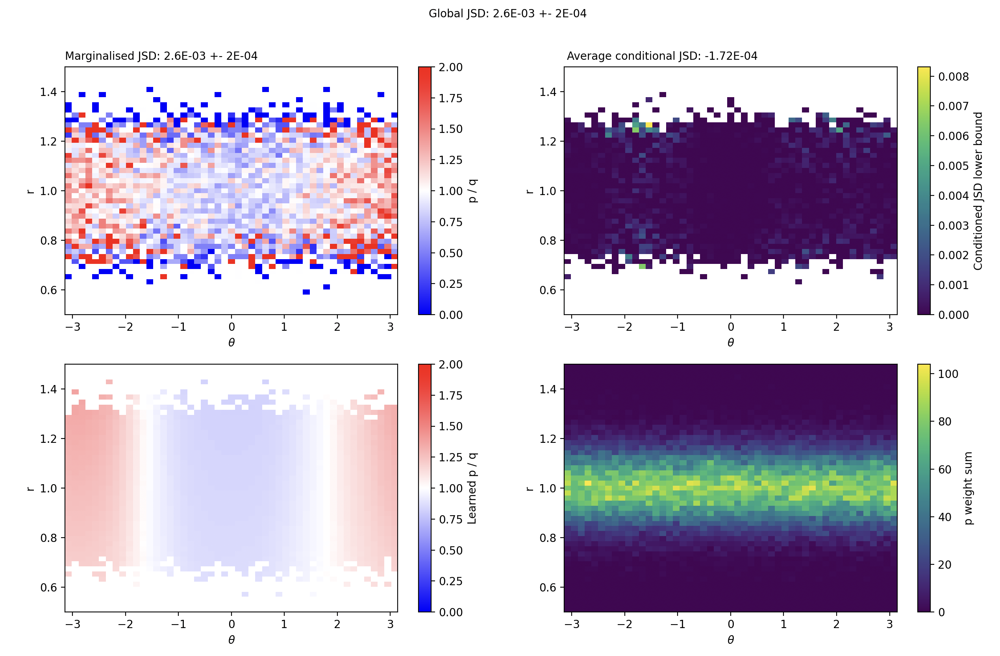

# `iwpc.divergences`

The end-to-end divergence-estimation flow of `iwpc`: the math (`DifferentiableFDivergence` and concrete f-divergences), the LightningModule estimator hierarchy that learns the variational lower bound, the `calculate_divergence` entry point that drives a training run, and the `run_reweight_loop` driver that iteratively peels off learnt features.

## Purpose

For two distributions `p` and `q` from which you have samples, `iwpc.divergences` lets you fit a neural critic that outputs a lower bound on the f-divergence `D_f(p, q)` (KL, Jensen–Shannon, ...). The package follows [arXiv:2405.06397](https://arxiv.org/abs/2405.06397):

```
D_f(p, q) >= E_p[f'(p/q)] - E_q[f*(f'(p/q))]
```

You pick a divergence (KL, JS, or a custom subclass of `DifferentiableFDivergence`), the package builds an `FDivergenceEstimator` that learns `log(p/q)`, evaluates the right-hand-side, and returns the bound as the validation metric `val_Df` (higher = tighter).

## Layout

### Math layer

- `base.py` — `DifferentiableFDivergence`, the abstract interface. Declares the six `_*_torch` / `_*_np` hooks subclasses must implement (`_f`, `_f_conj`, `_f_dash_given_log` in both numpy and torch), the three public `f` / `f_conj` / `f_dash_given_log` dispatchers, and the helpers (`calculate_naive_p_summands_given_log`, `calculate_naive_q_summands_given_log`, `calculate_naive_rep_summands_given_log_by_label`, `naive_estimate_given_log`) that the training loop and accumulators call.
- `kl_divergence.py` — `KLDivergence`. `f(x) = x log x`, `f*(x) = exp(x - 1)`, `f'(log x) = 1 + log x`.
- `jensen_shannon_divergence.py` — `JensenShannonDivergence`. `f(x) = 0.5 (x log x - (x+1) log((x+1)/2))`, with a `logaddexp`-based stable form for `f'`.

### Estimator hierarchy

- `fdivergence_base.py` — `FDivergenceEstimator`, the abstract Lightning base class that fixes the training contract, the Adam + `ReduceLROnPlateau(monitor="val_Df", mode="max")` optimiser, and the train / val step. Subclasses implement three abstract methods: `_configure_metrics` (must set `self.val_Df` and `self.val_Df_err`), `_calculate_batch_loss` (returns the negative of the train estimate), and `_accumulate_validation_Df`.
- `naive.py` — `NaiveVariationalFDivergenceEstimator` implements the naive variational representation directly using two `WeightedMeanMetric` accumulators for the p- and q-side expectations. `GenericNaiveVariationalFDivergenceEstimator` wires it to a network built by `iwpc.models.basic_model_factory` and accepts either an int input dim or an `Encoding` as its `input` argument.
- `asymmetry_estimator.py` — `AsymmetryEstimator` estimates the f-divergence between `p` and its image under a `GroupAction`, by Haar-averaging the q-side summand so the network only has to learn the asymmetric component.

### Training entry points

- `calculate_divergence.py` — `calculate_divergence(module, data_module, ...)`, the canonical entry point. Wraps an `FDivergenceEstimator` and a `LightningDataModule` in a Lightning `Trainer` with `ModelCheckpoint(monitor="val_Df", mode="max")`, `EarlyStopping`, and `LearningRateMonitor`; runs `trainer.fit`; reloads the best checkpoint; validates; and returns a `DivergenceResult` (`divergence`, `divergence_stderr`, `best_module`, `trainer`, `best_model_checkpoint_path`, `data_module`).
- `reweight_loop.py` — `run_reweight_loop(...)`. Repeatedly calls `calculate_divergence`; whenever the significance exceeds `min_sig`, adds a `p_over_q_{i}` column to the dataset, multiplies the weight column by `min(p/q, q/p)` (clipped at 1) to wipe out the learnt feature, and re-runs with a decayed learning rate. `calculate_total_divergence` reconstructs the cumulative divergence from the chain of reweight columns. Requires `PandasDirDataModule` (see [`iwpc.data_modules`](../data_modules/README.md)).

## Conventions

- **Batch contract:** `(features, labels, weights)` with `labels == 0` for samples from `p` and `labels == 1` for samples from `q`.
- **Validation metric:** `val_Df` (higher is better — it is a lower bound) and `val_Df_err` (its standard error). `EarlyStopping`, `ModelCheckpoint`, and the LR scheduler all monitor `val_Df` with `mode="max"`.
- **Numerical stability:** `log(p/q)` is clipped to `[-14, 14]` before exponentiation in the naive estimator. Follow the same pattern in new estimators.

## Usage

### Estimate a divergence end-to-end

```python
from iwpc.data_modules.pandas_data_module import BinaryPandasDataModule
from iwpc.divergences import (
    calculate_divergence,
    GenericNaiveVariationalFDivergenceEstimator,
    KLDivergence,
)

dm = BinaryPandasDataModule(
    p_df=p_df, q_df=q_df,
    feature_spec=[["x", "y"], ["__label"]],
    weight_col="weight",      # optional
)
estimator = GenericNaiveVariationalFDivergenceEstimator(
    input=2, divergence=KLDivergence(),
)
result = calculate_divergence(estimator, dm, trainer_kwargs={"max_epochs": 200})
print(result.divergence, "±", result.divergence_stderr)
```

Logs and checkpoints land under `<log_dir>/lightning_logs/<run>/`. Monitor with `tensorboard --logdir lightning_logs`.

For input data with known structure (angles, even / odd dependences, matrix-shaped features), pass an [`Encoding`](../encodings/README.md) as `input=`:

```python
from iwpc.encodings import TrivialEncoding, ContinuousPeriodicEncoding

# (r, theta) -> (r, cos theta, sin theta)
encoding = TrivialEncoding(1) & ContinuousPeriodicEncoding()
estimator = GenericNaiveVariationalFDivergenceEstimator(
    input=encoding, divergence=KLDivergence(),
)
```

### Evaluate a divergence's generating function

```python
import torch, numpy as np
from iwpc.divergences import KLDivergence

kl = KLDivergence()
x_t = torch.tensor([0.5, 1.0, 2.0])
print(kl.f(x_t))                            # torch -> torch
print(kl.f_dash_given_log(torch.log(x_t)))  # 1 + log(x)
print(kl.f(np.array([0.5, 1.0, 2.0])))      # numpy -> numpy, same call
```

Always call `f`, `f_conj`, `f_dash_given_log`; the underscore-prefixed `_f_torch` / `_f_np` etc. are implementation hooks.

### Reweight loop on a large sharded dataset

For datasets that don't fit in memory, or networks that get stuck in local minima, use `run_reweight_loop` with `PandasDirDataModule`. The directory module reads a layout of `file_0.pkl … file_{N-1}.pkl` shards plus a `ds_info.yml` index, and the reweight loop iteratively peels off learnt features so the network can focus on the residuals.

```python
from iwpc.data_modules.pandas_directory_data_module import PandasDirDataModule
from iwpc.divergences import (
    GenericNaiveVariationalFDivergenceEstimator,
    JensenShannonDivergence,
    run_reweight_loop,
)

dm = PandasDirDataModule("sample_dataset", feature_spec=["r", "theta"])
estimator = GenericNaiveVariationalFDivergenceEstimator(
    input=2, divergence=JensenShannonDivergence(),
)
results = run_reweight_loop(estimator, dm, min_sig=3.0, max_iterations=10)
```

Each iteration that beats the significance threshold appends a new `p_over_q_{i}` column to the dataset; `calculate_total_divergence` reconstructs the cumulative divergence from their product. The full walkthrough — including the diagnostic plots — lives in [`examples/example_reweight_loop.py`](../../../examples/example_reweight_loop.py).

### Diagnostic plots

Once a network is trained, `BinnedDfAccumulator` answers the follow-up question: **how is the network telling p and q apart?** It partitions samples by user-chosen variables and attributes the global divergence to each bin.

The example below trains on 2D vectors from `N(r | 1.0, 0.1) * (1 + eps cos theta) / (2π)` for two values of `eps`, then bins the validation set by `r` (panel 1), `theta` (panel 2), and `(r, theta)` jointly (panel 3).

In the `r` panel, top-left shows the val histogram of `r` under p and q (they agree — both Gaussian in `r`), so the marginalised divergence in `r` alone is consistent with zero. Top-right shows the divergence within each `r` bin, flat as expected.



In the `theta` panel, the marginalised divergence matches the global value: all of the divergence comes from `theta`. The bottom panels show the network's reconstructed distributions in `theta`. Error bars indicate **how well we can read out what the network believes**, not how close that belief is to the truth — these "learned" quantities may well demonstrate hallucinations.



The 2D `(theta, r)` panel is mostly redundant for this dataset, but confirms the same features. Top-left: ratio of the two distributions in validation. Top-right: divergence within each bin. Bottom-left: the network's learned ratio. Bottom-right: histogram of p.



`BinnedDfAccumulator`'s plotting currently supports 1D and 2D only. See [`iwpc.accumulators`](../accumulators/README.md) for the constructor signature and other accumulators that work without an attached network.

### Measure the asymmetry of a distribution under a group action

`AsymmetryEstimator` estimates `D_f(p, g·p)` where `g·p` is the image of `p` under a `GroupAction`. The q-side summand is averaged over a Haar sample of the group at every evaluation, so the learnt scalar field captures only the asymmetric component.

```python
from iwpc.divergences import AsymmetryEstimator, KLDivergence
from iwpc.models.utils import basic_model_factory

model = basic_model_factory(input=3, output=1)
estimator = AsymmetryEstimator(
    group=my_group_action,      # an iwpc.symmetries.GroupAction
    model=model,
    divergence=KLDivergence(),
)
```

### Compute the naive estimator by hand from precomputed `log(p/q)`

```python
import torch
from iwpc.divergences import KLDivergence

kl = KLDivergence()
log_p_over_q = torch.tensor([1.2, -0.4, 0.0, 0.8])
label        = torch.tensor([0,    1,    0,   1])  # 0 = p, 1 = q
weights      = torch.ones(4)

Df_hat = kl.naive_estimate_given_log(log_p_over_q, label, weights)
print(float(Df_hat))   # a lower bound on D_KL(p || q)
```

For analysis with proper error bars, prefer one of the accumulators in [`iwpc.accumulators`](../accumulators/README.md) (`DfAccumulator`, `BinnedDfAccumulator`) which consume the same `DifferentiableFDivergence` interface.

## Writing your own estimator

Subclass `FDivergenceEstimator`, implement `_configure_metrics` / `_calculate_batch_loss` / `_accumulate_validation_Df`, ensure `_configure_metrics` assigns `self.val_Df` and `self.val_Df_err` (typically from `iwpc.metrics.WeightedMeanMetric`), and respect the labels-0=p / labels-1=q contract. Anything logged as `val_Df` will be picked up automatically by `calculate_divergence`.

## Writing your own divergence

Subclass `DifferentiableFDivergence`, call `super().__init__(name, short_name)`, implement the six `_*_torch` / `_*_np` hooks (mirror the math exactly across backends), and re-export from `__init__.py`. Prefer log-space identities (`torch.logaddexp`, `torch.log1p`, `np.logaddexp`, `np.log1p`) so `_f_dash_given_log_*` stays finite for `log_x` in `[-14, 14]`.
